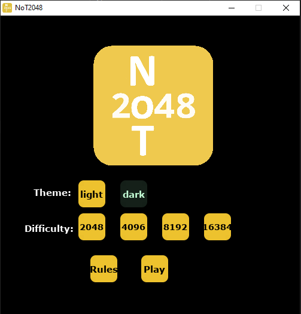
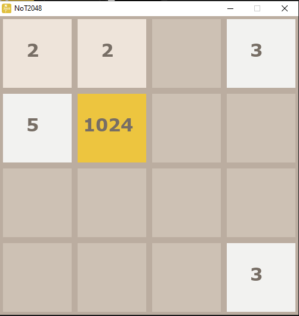

# NoT 2048 
An original spin-off of the classic web based single-player puzzle game 2048

It was designed by Italian web developer [Gabriele Cirulli](https://github.com/gabrielecirulli).

It is a fork of https://github.com/rajitbanerjee/2048-pygame and replacing the game logic and mechanics

## Getting Started
1. Get Python 3.x and clone this repository
2. Get [pip](https://www.makeuseof.com/tag/install-pip-for-python/), then install pygame:\
    ```$ pip install pygame```

3. Run the game:\
    ```$ python main.py```
    
      

## Moves
1. NoT2048 is played on a gray 4×4 grid, with numbered tiles that slide when a player moves them using the **four arrow keys** or **W A S D**.
2. Press **'r'** to **restart** the game.
3. Join the numbers and get the master tile to **1** to win!

## Game Rules
1. When the game starts a master tile will be spawned based on chosen difficulty(2048/4096/8192/16384)
2. Every turn, a new tile will randomly appear in an empty spot on the board with a value of either 3 or 5.
3. Tiles slide as far as possible in the chosen direction until they are stopped by either another tile or the edge of the grid. 
4. If two tiles of different numbers collide while moving, they will merge into a tile with the subtracted value of the two tiles that collided.
5. If a tile collids with the master tile and if the master tile is divisible by the tile, they will merge into a master tile with the divided value of the two tiles.
6. The resulting tile cannot merge with another tile again in the same move. 
7. If a move causes three consecutive tiles of the same value to slide together, only the two tiles farthest along the direction of motion will combine. 
8. If all four spaces in a row or column are filled with tiles of the same value, a move parallel to that row/column will combine the first two and last two.
